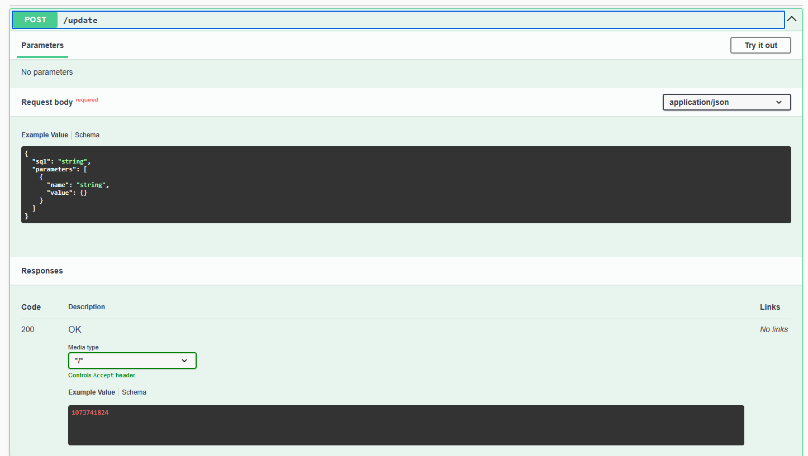
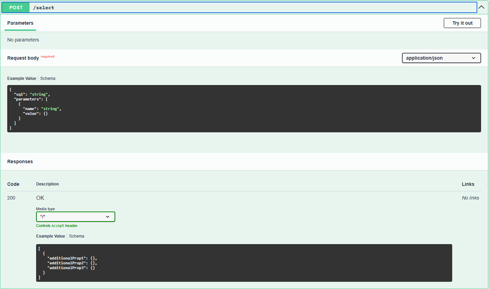
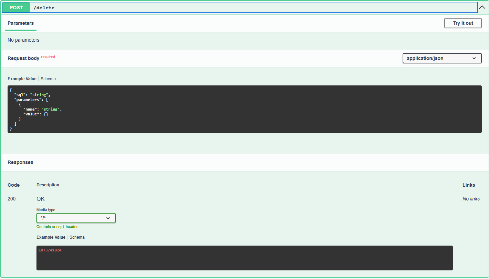
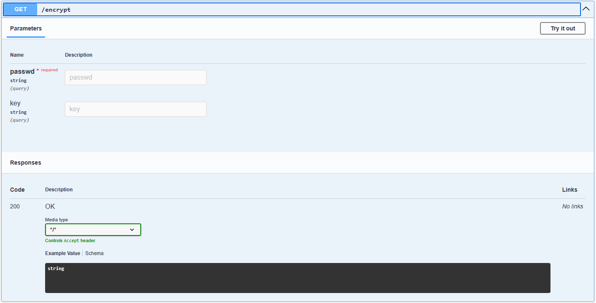
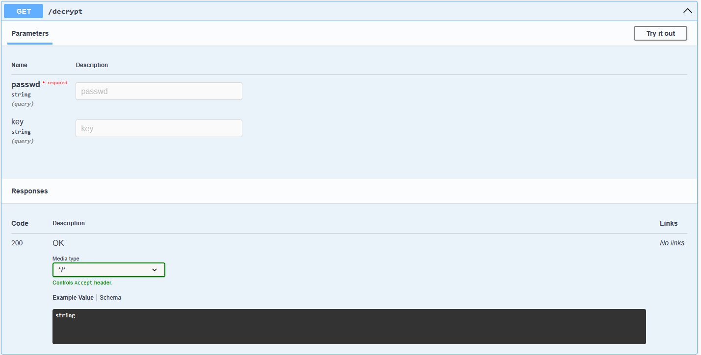

# sql2rest

## Introduction

SQL2Rest is a simple utility to allow users to execute SQL select and update and delete statements over a Restful API

The key data structure is the SQLRequest whose JSON representation is

```json
{
  "sql": "string",
  "parameters": [
    {
      "name": "string",
      "value": {}
    }
  ]
}
```

The SQL is the the SQL statement to be executed. It supports name parameters using the ``:<parameter_name>`` syntax

The values of the parameters can be set by adding them in the ``parameters`` array 

Their name in the ``name`` field and their value in the ``value`` field

### Return values

In case of a select statement the returned rows are encoded into a JSon array:

```json
[
  {
    "additionalProp1": {},
    "additionalProp2": {},
    "additionalProp3": {}
  }
]
```

In case of an update or delete statement the number of rows affected is returned as an Integer

## ReSTful endpoints

### /update



### /select



### /delete



### /encrypt



### /decrypt




## Configuration

The application is configured by means of the application properties file

The database connection URL, driver and username is configured via the default ``spring.datasource`` properties

There are 3 ways the password can be configured that are selected using the ``password.safe`` property

If the value of ``password.safe`` is ``keystore`` the password is stored in a java keystore. The keystore filename and password are configured using the ``keystore.filename`` and ``keystore.password`` properties, respectively.

In this case the ``spring.datasource.password`` property holds the password alias in the keystore.

To add the password to the keystore one can use the command line below:
```bash
$ keytool -importpass -alias <the password alias> -keystore <the keystore filename> -storepass <the keystore password>
```

If the value of ``password.safe`` is ``aes`` then the value in the ``spring.datasource.password`` property holds the encrypted password

The encryption key is configured in the ``encryption.key`` property

There are two ReST endpoints ``/encrypt`` and ``/decrypt`` that allow one to encrypt a plaintext password or decrypt an encrypted one either using an explicit key or (by leaving the key parameter empty) the key configured in teh application.properties


If the value of ``password.safe`` is ``plain`` then the value in the ``spring.datasource.password`` property holds the plaintext password

```properties
spring.application.name=sql2rest

password.safe=keystore
keystore.filename=mykeystore.jks
keystore.password=changeit

#password.safe=aes
#encryption.key=H3ll0SLMH0wAr3You?

#password.safe=plain

spring.datasource.url=jdbc:oracle:thin:@localhost:1521:xe
spring.datasource.driverClassName=oracle.jdbc.driver.OracleDriver
spring.datasource.username=slm
spring.datasource.password=slm
```

## Built in database support

The application includes drivers for:

1. Postgrasql
2. Oracle
3. SQL Server
4. MySQL
5. H2 SQL database